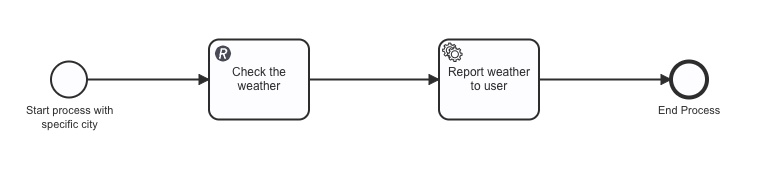

# Node.js Weather-Checker Slackbot
This example demonstrates parts of the [Camunda 8 Node.js SDK](https://docs.camunda.io/docs/apis-tools/node-js-sdk/), using a slackbot as a simple example.

The bot will respond to a user's message with the current weather for a given location:

The process takes a city as a string and calls the [API Ninjas Weather API](https://api-ninjas.com/api/weather) with that specific city using the [REST Connector](https://docs.camunda.io/docs/components/connectors/protocol/rest/). The API returns weather information that is sent back to the slackbot.

The slackbot has three commands:
- `/weather [city]` -- this command runs through the procsess above and returns all variables from Operate.
- `/export [type] [id]` -- this command exports an Optimize dashboard or report as a file. It takes two parameters, `type` and `id`. Type refers to the type of Optimize report to be returned, either a `dashboard` or a `report` followed by the corresponding id of the dashboard or report.
- `/label [variable] [variableType] [label]` -- this command allows you to rename varible labels on your Optimize dashboard. It takes three commands, `variable`, the variable name, `variableType`, the variable type, and `label`, the new label to go on the dashboard.

Attatched is a sample Optimize Dashboard as an example.

___

## Requirements
This project requires a [Slack developer account](https://api.slack.com/apps/), as well as a free [API key from APINinjas](https://api-ninjas.com/).
## Setup
Setting this project up locally consists of two main parts:
### 1. Registering an app with Slack
- Create a [Slack developer account](https://api.slack.com/apps/) and [create a new app](https://api.slack.com/tutorials/tracks/create-bot-to-welcome-users) called `Weather Checker`.
- After creating a new app, under Basic information, go to App-Level Tokens and generate a new token. Give this token the `connections:write` and `authorizations:read` permissions
- Under OAuth & Permissions, and find the Scopes section and add the following Bot Token Scopes:
    - `app_mentions:read`
    - `chat:write`
    - `commands`
    - `files:write`
    - `im:history`
    - `im:read`
    - `im:write`
- Under the Slash Commands tab, add three commands:
    - `/weather`
    - `/export`
    - `/label`
- Lastly, add the OAuth generated token, signing secret, and app token into the `.env` file in this project and install Slack's API with `npm i @slack/bolt`.

### 2. Setting up the Camunda 8 Node.js SDK
- Install the Camunda 8 Node.js SDK using npm by running `npm install @camunda8/sdk`
- Create a new Camunda 8 cluster and [set up client connection credentials](https://docs.camunda.io/docs/guides/setup-client-connection-credentials/), making sure the `Zeebe`, `Operate`, and `Optimize` scopes are enabled. Or, access your existing client credentials in your Camunda 8 cluster. Be sure to add the credentials to the `.env` file.
- Add your [API key from APINinjas](https://api-ninjas.com/) under the name `ApiNinja`

## Running the Project
Run the index.js file `node index.js`
This will start the Slackbot and after inviting the bot to your channel of choice (using `@Weather Checker`), it will be able to respond to commands in the Slack channel.

